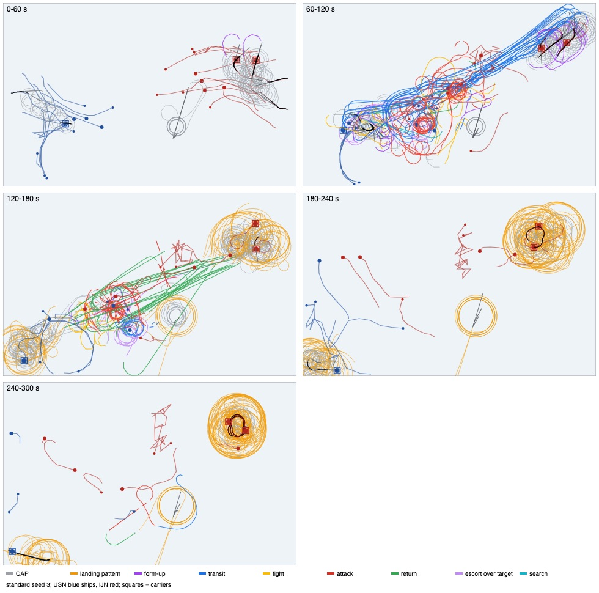
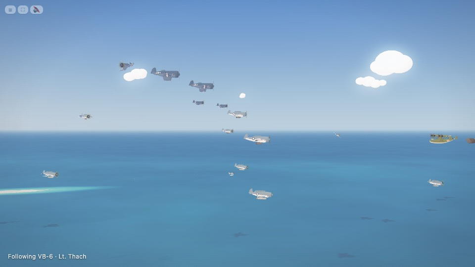
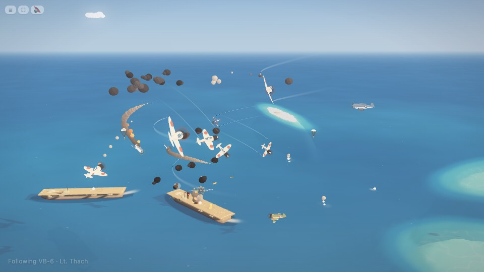
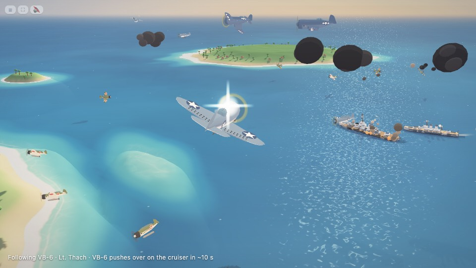
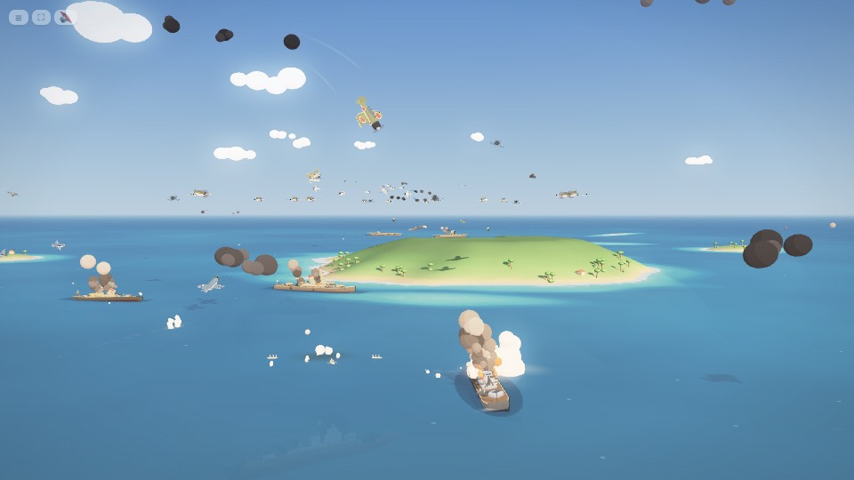

# Plane review: flight data, 1942 reference values and targets

This review measures how the planes fly today. It compares the numbers with 1942 performance and sets targets for the work on item 15 (plane behaviour and battle shape, with items 1 to 3). Implementation agents build on it. No gameplay code was changed.

**The user's goal:** "make the plane realism … entertaining to watch as well as realistic-ish. I want to wake up to awesome airplanes." The complaints were: planes circle the carrier while the ships fight, too much circling, planes wander alone, fighters are aimless, attacks are not swift, and the planes do not act like an air wing. The user wants constant flight ops, big cohesive formations, aggressive CAP, coordinated attacks, and an air war before the fleets see each other. Doctrine should set the style, and the action should climb steadily.

## 0. Bottom line

The air war today is one burst. The first strikes leave at about 50 s and drop at about 105 s, and that is already after the destroyer screens are trading fire (at about 55 to 70 s). After that, the air groups spend minutes circling their carriers in the landing pattern while the surface fight goes on mid-map (track map below). Three mechanisms cause most of it:

1. **A recovery-bound deck.** Recovery takes 52 to 56% of deck time. A recovered sortie spends 57 s (p50) in the landing pattern, which is 46% of its flying time. Launches wait behind recoveries 26 to 35% of the time.
2. **Ghost waves.** The strike timer fires again while the last strike is still waiting below deck. `newWave` then deletes that strike's wave, so 33 to 48% of bomber sorties never belong to a wave and fly to the target alone.
3. **A merry-go-round CAP.** CAP orbits a 35 u circle (1.3 hull lengths) over the carrier, about 7 s per lap, with a p90 bank of 46 to 52°. That is 90 to 94% of CAP time, and 42 to 43% of all carrier-plane airborne time.



*Standard seed 3, plane tracks by minute. 60 to 120 s: the IJN strike stream (blue) and its attack (red) on the USN ships mid-map, which are already engaged. 120 to 180 s: the strike returns (green). From 180 s on, nothing flies but the landing circles (orange) round both carriers for two minutes, while the IJN ships (red dots) fight on mid-map.*

## 1. How it was measured

- `tests/flight_review.js` is a node runner: seeded, sim-only, with a read-only recorder in `tests/flight_review_rec.js`. Every 0.25 sim s it records each plane's position, altitude, speed (by finite difference), vertical speed, turn rate, bank (`plane.roll`), phase, squadron / element / wave, and the distances to its leader and to mission-mates. It also records bus events (drops, impacts, kills, shells, ship damage, launches, traps, waves) and the deck state of each carrier. `--check` replays the rounds with and without the recorder and compares the results: they are identical.
- **Canonical run** (all tables below unless marked): `node tests/flight_review.js --seeds 5 --workers 3`, which runs standard, carrier_duel, midway and night, seeds 1 to 5 (20 rounds). The night rounds launch no planes (5 of 5), so the per-round, pacing and ops figures use the 15 rounds with flight ops.
- **Confirmation run:** `--seeds 10 --seed0 101 --only standard,carrier_duel,midway` (30 rounds). Every headline number agrees within a few points. Where the two runs differ it is noted as "conf.".
- **Pictures:** `tests/flight_shots.js` (render mode, 960×540, fake frame clock: story camera on a strike from launch, CAP orbit, landing circle, intercept, dogfight, dive and torpedo frame sequences, escorted strike) and `tests/flight_tracks.js` (top-down track maps from a `--trace` round). Every image was looked at. A selection is in `docs/plane_review/`.

```
node tests/flight_review.js --seeds 5 --workers 3                  # report + tests/shots/flight_review.json
node tests/flight_review.js --trace standard:3 --workers 1         # raw tracks of one round
CHROMIUM=… node tests/flight_tracks.js tests/shots/flight_trace_standard_3.json 60 300
python3 -m http.server 8775 & BASE_URL=http://localhost:8775/ CHROMIUM=… node tests/flight_shots.js 3 [opening,cap,circle,story,intercept,dogfight,dive,torp,escort]
```

Units: 1 u (game unit; nominally 2 m, but hulls are compressed, see section 3). L = a carrier's hull length = 26 u. Times are sim seconds. At 1× the screen runs at half speed (`BASE_SPEED` 0.5), so 1 sim s = 2 s real.

## 2. Measured data

### 2.1 Kinematics by phase (carrier planes, both nations pooled where equal)

Values are p50 [p10 to p90]. Turn rates are measured from the track, not from `plane.turn`.

| type / phase | speed u/s | altitude u | vy p90 / p10 | turn p50 / p90 / max rad/s | bank p90 rad |
|---|---|---|---|---|---|
| fighter CAP | 31 to 33 [24 to 42] | 29 [28 to 38] | 2 / 0 | 1.1 / 1.1 / 2.7 | 0.8 to 0.9 (46 to 52°) |
| fighter intercept | 37 to 40 [30 to 44] | 29 [11 to 46] | 6 / −10 | 0.9 to 1.1 / 1.8 to 2.0 / 2.8 | 1.1 |
| fighter dogfight | 38 [33 to 46] | 30 to 37 | 4 to 6 / −8 to −11 | 0.9 to 1.1 / 1.6 to 2.1 / 2.4 | 1.1 |
| fighter escort in transit | 21 to 22 [16 to 38] | 44 [18 to 54] | 0 to 2 / −1 to −4 | 0.2 / 1.1 to 1.4 | 0.6 to 0.8 |
| dive / torpedo in transit | 20 [17 to 31] | 34 (VB) / 24 (VT) | 1 / 0 | 0.1 / 0.3 to 0.7 | 0.2 to 0.4 |
| dive bomber wheel | 25 [25 to 29] | 39 [38 to 41] | 1 / 0 | 1.0 to 1.1 / 1.2 to 1.3 | 0.8 |
| dive bomber dive | 27 [25 to 29] | 32 [18 to 39] | −1 / −27 | 1.1 / 2.5 | 0.9 |
| dive bomber pull-out | 30 | 16 [11 to 23] | 8 / −21 | 0 / 0.1 | 0 |
| torpedo anvil setup | 26 | 14 to 16 [6 to 18] | 1 to 2 / −4 | 0.5 to 0.8 / 1.1 | 0.7 |
| torpedo run | 26 | 3.5 to 4.5 [2 to 14] | 0 / −7 | 1.1 / 1.2 | 0.8 |
| landing pattern | 19 to 29 (by type) | 12 to 32 [6.5 to 36] | 1 / −2 | 0.3 to 0.4 / 1.4 | 0.6 to 0.8 |
| takeoff climb | 16 to 18 | 4 [2 to 10.5] | 5 / −1 | 0 | 0 |
| scout / flying boat search | 22 | 26 to 31 | 0 | 0.1 to 0.5 | 0.3 to 0.6 |

Flight-model constants: fighter turn 1.7 rad/s (Zero 2.05, Wildcat 1.55), climb 7 u/s (8.5 / 6), dive 52 (47 / 57). Dive bomber turn 1.1, torpedo bomber 1.0 (`core.js` `PLANE_FLIGHT`, `PLANE_NATION`). The strike guide flies at 20 u/s (`air_strikes.js` `GUIDE_V`).

### 2.2 Time budgets per sortie

Share of sortie time by category. Circling means the trailing 10 s of track has net displacement < 0.4 × path length. The circling share is of non-pattern airborne time; the landing pattern is counted separately.

| sorties | n | length p50 s | deck | launch | form-up | transit | patrol | fight | attack | return | landing | circling |
|---|---|---|---|---|---|---|---|---|---|---|---|---|
| IJN CAP fighter | 139 | 183 | 19% | 2% | 0 | 0 | 52% | 3% | 0 | 0 | 25% | **94%** |
| USN CAP fighter | 77 | 168 | 20% | 2% | 0 | 2% | 49% | 8% | 0 | 0 | 20% | **91%** |
| IJN escort | 41 | 178 | 5% | 2% | 15% | 10% | 18% | 4% | 0 | 3% | 43% | 48% |
| USN escort | 38 | 160 | 7% | 2% | 10% | 14% | 29% | 4% | 0 | 2% | 32% | 53% |
| IJN dive | 113 | 98 | 26% | 3% | 3% | 19% | – | – | 6% | 7% | 37% | 20% |
| USN dive | 92 | 90 | 31% | 3% | 2% | 17% | – | – | 7% | 7% | 33% | 28% |
| IJN torpedo | 105 | 100 | 26% | 3% | 2% | 15% | – | – | 12% | 7% | 36% | 18% |
| USN torpedo | 65 | 107 | 20% | 3% | 2% | 12% | – | – | 20% | 7% | 37% | 23% |

- Circling by place, as a share of all carrier-plane airborne time (pattern excluded): CAP over its carrier 43% (conf. 42%), then patrol elsewhere 3%, form-up over the carrier 3%, attack over the target 3% (the dive wheel).
- **Landing pattern per recovered sortie: p50 57 s, p90 121 s. That is 47% of the sortie's flying time** (conf. 57.5 s / 46%).
- Strike bombers spend 20 to 31% of their sortie below or on deck, waiting to launch.
- Bomber sorties that joined their wave while it was forming / after it had left / never had a wave: **USN 32% / 34% / 33%, IJN 36% / 15% / 48%** (conf. USN 23 / 35 / 43, IJN 44 / 20 / 36).
- Armed carrier-bomber sorties by outcome: dropped USN 55% / IJN 51%; jettisoned 19% / 17%; lost while armed 18% / 11% (mostly on deck: deck fires, carriers escaping); still armed at the end of the round 3% / 17%; landed still armed 4% / 5%.

### 2.3 Strike timeline (per wave)

| waves | n | target distance at order | order → first plane up | form-up (up → departs) | departs → within 140 | order → first drop | first → last drop | waves with no drop | planes p50 |
|---|---|---|---|---|---|---|---|---|---|
| IJN first, joint | 29 | 399 | 11.3 | **20.0** | 12.3 | 52.7 | 7.6 | 38% | 5 |
| USN first, group | 20 | 404 | 11.4 | **20.0** | 12.0 | 63.6 | 11.7 | 35% | 6 |
| USN later, squadron | 85 | 384 | 11.5 | 0 | 15.5 | 41.8 | 0 | 85% | 0 to 1 |
| IJN later, deckload | 144 | 498 | 8.3 | 2.3 | 22.7 | 55.7 | 4.2 | **88%** | **0** |

- Form-up is always exactly 20.0 s, the `FORM_WAIT` cap. **First strikes never leave because they are formed; they always leave on the timer**, with planes still on deck.
- About 20 waves are ordered per round with carriers, most of them empty. Waves that dropped, per carrier that struck: 1.8 (conf. 1.7). 62% of carriers make a second effective strike (conf. 52%), and it comes p50 27 s after the first, so it is the other squadron of a USN piecemeal launch, not a real second strike.
- First strike order at a median 52 s; first enemy ship contact at a median 45.5 s (scouts, else the destroyer screens).

### 2.4 Formation quality

- Share of time with no same-mission plane (same carrier, kind and CAP / strike) within 30 u:

| phase | USN dive | USN torp | IJN dive | IJN torp | USN ftr | IJN ftr |
|---|---|---|---|---|---|---|
| form-up | 90% | 74% | 89% | 89% | 46% | 26% |
| transit (in the wave) | 60% | 41% | 42% | 46% | 33% | 25% |
| approach (not in formation) | 82% | 85% | 88% | 82% | – | – |
| return | 92% | 79% | 100% | 88% | 84% | 70% |
| CAP | – | – | – | – | 20% | 20% |

- Wingman to leader distance: p50 10.9 u (the slot is about 11.7), p90 47 u.
- A strike in transit: the farthest member is 29 u (p50) from the centroid, 7 to 8% are stragglers (more than 60 u from the centroid), and the closest pair is 9 to 10 u apart. Stack: fighters 43, dive 33, torpedo 23 u. That is a 20 u spread, so on screen it reads as a diagonal stream, not a stack.
- Close escort sits 5 u ahead, 10 u abeam and 15 u above the bomber centroid. Top cover sits 30 ahead, 21 abeam, 26 above.

### 2.5 Fighters

| | airborne s | with a foe | on bombers | on fighters | no foe | no foe while a raid is within 160 u of the carrier | circling |
|---|---|---|---|---|---|---|---|
| IJN CAP | 15,820 | 7% | 6% | 0% | 93% | 1% | 93% |
| USN CAP | 10,018 | 13% | 13% | 1% | 87% | 2% | 90% |
| IJN escort | 2,701 | 11% | 0 | 11% | 89% | – | 41% |
| USN escort | 2,266 | 10% | 0 | 10% | 90% | – | 36% |

- CAP is not aimless when a raid comes: idle-during-raid is 1 to 2%. It is aimless because, for 90% of its time, there is nothing to do but orbit.
- Engagements are short. CAP on armed bombers: p50 2.5 to 3.0 s, and 25 to 35% end within 2 s. Escort on fighters: p50 1.3 to 1.5 s, and 58 to 67% end within 2 s (the 0.4 s rescan switches foes).
- **Fighter-on-fighter fights kill almost nobody:** 0.0 kills per engagement. Fighter losses in 15 rounds: USN 9 (aa 3, ditch 4, carrier lost 1, fighter 1), IJN 0 (conf. 30 rounds: fighter kills on fighters 5).
- Kills per engagement on armed bombers: 0.1 (IJN CAP) to 0.2 (USN CAP).
- Where CAP first meets each armed raider, as the raider's distance from the defended carrier: USN p10 27, p50 132, p90 155 u; IJN p10 97, p50 151, p90 156 (n 108 / 50). The p50 sits at the long leash (157.5). The USN p10 of 27 u means raiders that reach the deck before anyone touches them.
- Fight-time modes: CAP pursues 91 to 96% of the time, so the fight is a turning chase. USN escorts use boom 27 to 36% and zoom 20 to 25%. Defending is 2 to 5% of fight time.

### 2.6 Attacks and losses

| | n | push-over alt | release alt | dive angle at release | dive speed | push-over → release | hit rate |
|---|---|---|---|---|---|---|---|
| USN dive bombing | 50 | 38.8 | 16.0 (p10 13.5) | 67.6° (p10 61°) | 30.4 | **1.2 s** | **90%** (conf. 85%) |
| IJN dive bombing | 57 | 38.8 | 15.2 (p10 13.4) | 66.5° (p10 62°) | 30.6 | **1.3 s** | **70%** (conf. 64%) |

| | n | drop alt | drop speed | range p50 [p10 to p90] | angle off the bow | hit rate |
|---|---|---|---|---|---|---|
| USN torpedo | 40 | 1.9 | 26.0 (= cruise) | 61 [58 to 62] | 48° [29 to 84] | 50% (conf. 66%) |
| IJN torpedo | 38 | 2.1 | 26.0 (= cruise) | 61 [52 to 62] | 57° [30 to 86] | 71% (conf. 58%) |

- Anvil: torpedo groups (two or more drops from the same wave on the same target) come in from both bows 71% of the time (n 14; conf. 78%, n 27). Their first to last drop is 14.6 s.
- First bomb vs first torpedo of the same wave: p50 4.8 s (conf. 3.3 s), p90 27.6 s. VB and VT arrive together.
- Level bombing (B-17, Betty, Kate on the island): 65 drops, release at 47.6 u, 9% hits.
- **Losses: fighters 54, AA 4** (carrier and base planes, 15 rounds). Bombers are shot down mostly on the way home (return 15 of 20 IJN dive bombers, 15 of 26 IJN torpedo bombers). Almost none is shot down still armed: CAP breaks raids up by crippling bombers (they jettison, 17 to 22%), not by kills.

### 2.7 Pacing (per sim minute, mean over the 15 rounds with flight ops)

| min | rounds | airborne (non-pattern) | CAP | strike | circling | fighters engaged | launches | traps | drops | kills | shells | gun dmg | air dmg |
|---|---|---|---|---|---|---|---|---|---|---|---|---|---|
| 0 | 15 | 6.5 | 5.8 | 0.7 | 4.5 | 0.0 | 19.7 | 0.0 | 0.2 | 0.1 | 4.5 | 13 | 87 |
| 1 | 15 | 22.1 | 9.5 | 12.5 | 10.2 | 1.4 | 16.1 | 0.8 | 5.6 | 2.0 | 62 | 565 | 1285 |
| 2 | 15 | 15.3 | 8.4 | 6.8 | 8.6 | 1.4 | 3.3 | 5.9 | 7.5 | 2.0 | 41 | 644 | 1846 |
| 3 | 12 | 3.9 | 3.1 | 0.8 | 3.1 | 0.1 | 6.5 | 7.8 | 1.3 | 0.2 | 40 | 432 | 510 |
| 4 | 10 | 2.3 | 1.5 | 0.8 | 1.0 | 0.1 | 4.9 | 7.8 | 0.9 | 0.1 | 32 | 634 | 393 |
| 5 | 9 | 3.6 | 2.2 | 1.4 | 1.8 | 0.3 | 2.7 | 3.6 | 1.4 | 0.7 | 13 | 304 | 280 |
| 6 | 5 | 6.8 | 4.5 | 2.3 | 4.1 | 0.5 | 2.4 | 2.2 | 3.0 | 0.6 | 3 | 69 | 292 |

- Air activity peaks in minutes 1 and 2, then collapses to 2 to 4 airborne (plus the landing circle) while the surface fight goes on. **The action index by thirds of the round is 28.7 / 37.3 / 13.0** (conf. 35.5 / 32.7 / 16.5): it peaks early and fizzles.
- Round length: median 396 s (conf. 345 s). The time limit is 420 s.

**Air first?** These are the first events of each round:

| scenario | first air drop before first fleet gunfire | contact p50 | first drop p50 | first fleet gunfire p50 |
|---|---|---|---|---|
| carrier_duel | **0 / 5** (conf. 1 / 10) | 48 s | 113 s | 55 s (destroyer vs destroyer at 60 to 68 u) |
| standard | **0 / 5** (conf. 2 / 10) | 37 s | 105 s | 68 s |
| midway | 4 / 5 (conf. 5 / 10) | 45 s | 94 s | 107 s |

In carrier_duel the carriers start 909 u apart. The destroyer screens close at about 15 u/s and see each other at about 140 u around 48 s. Midway's air comes first only because the island base supplies early strikes and the main bodies take longer to meet.

### 2.8 Flight ops (carriers, 15 rounds with flight ops)

- Air group 12.3 to 12.5 planes per carrier (14 at the start). On average: hangar 31 to 36%, rearming 2 to 3%, on deck 12 to 14%, airborne or in the pattern 49 to 53%. Airborne share by minute: 14%, 64%, 84%, 64%, 35%, 22%, …
- Deck mode: **recover 52%**, launch 27 to 29%, idle 19 to 21%. Planes waiting to land: 2.2 to 2.6 on average. **Launches wait on a non-launch deck 26 to 31% of the time** (conf. 32 to 35%).
- Recovery interval with planes waiting: p50 15.3 s, p10 8.3 s, p90 37 s.
- A pilot's trap → next launch: p50 37.6 s, p90 75 s. This includes roster idle time; the rearm itself is 10 s (`aircraft.js REARM`).
- Per carrier-round: 20 launches, 9 recoveries.

### 2.9 What the screenshots show

 

 

1. **Strike in transit** (story camera, side shot): a long diagonal stream of 15 or so planes at many heights. It is lively, but it is a stream, not a stack of vics. Earlier, the chase shot of the same VB-6 leader showed it alone over a sandbar.
2. **CAP orbit:** two fighters on a tight circle over the carrier, bank steep, lap about 7 s. From a wide camera they look like a mobile hung over the ship.
3. **The landing circle:** after the first exchange, both carriers are ringed by planes at every height and heading for minutes. The track maps show it best: orange rings from 180 s to the end.
4. **The intercept happens over the decks:** Zeros swirl in tight vapour-trailed turns 20 to 40 u above the IJN carriers, among the flak bursts. It is dramatic, but it is in the wrong place, and the defenders and the flak share one altitude band.
5. **Dogfight:** busy and toy-like, with steep 70 to 90° banks and planes very large next to the ships (planes are about 4× oversized, item 1). With a turn radius of about 4 wingspans, the fights look like twirls, not turning battles.
6. **The dive is missed by the camera.** The story's attack shot (over the shoulder) shows the SBD level, "pushes over in ~10 s". By the next shot the dive is over: push-over to release takes 1.2 sim s (2.4 s real at 1×), which is shorter than one shot. In a fixed-camera sequence, the D3A's wing-over is visible, but the dive itself is a blink, from only 39 u.
7. **Caption mismatch:** "STRIKE AWAY: VB-6 against a carrier" appears about 20 s after the strike left, while the follow label says it reaches the cruiser (the CAG redirect does not update the caption).
8. **A torpedo run crosses an island** at wave height (`overLand` hop), which reads as a strafe of the island.
9. **A distant swarm:** 20 to 30 planes mill over the island in the background (the dive wheel, CAP and base planes) and read as a cloud of gnats.
10. The 5-plane "strike" in the escort shot passes over its own carrier at 81 s with three fighters above two bombers: not a big formation.

## 3. Real 1942 values and the game scale

### 3.1 Reference performance (typical published figures, rounded)

| | cruise | max | climb | sustained turn | notes |
|---|---|---|---|---|---|
| F4F-4 Wildcat | 135 kt | 275 kt | ~2,000 ft/min | 360° in ~18 to 20 s | rugged; dives well; Thach weave, hit and run against Zeros |
| A6M2 Zero | 180 kt | 290 kt | ~2,700 to 3,100 ft/min | 360° in ~12 to 14 s | turns inside anything at low speed; fragile, no armour |
| SBD-3 Dauntless | 130 kt | 215 kt | ~1,200 to 1,700 ft/min | – | **70° dive** from 14,000 to 20,000 ft; split dive brakes hold about 240 kt; release 1,500 to 2,000 ft; dive about 30 to 40 s |
| D3A1 Val | 160 kt | 210 kt | ~1,800 ft/min | – | **shallower dive, about 50 to 60°**, from about 10,000 to 13,000 ft; release about 1,500 ft |
| TBD-1 Devastator | 110 kt | 180 kt | ~700 ft/min | – | Mk 13 torpedo: drop at **50 ft or less and 110 kt or less**, about 1,000 to 1,500 yd out; runs at 33.5 kt; many failures |
| B5N2 Kate | 140 kt | 205 kt | ~1,300 ft/min | – | Type 91 torpedo: drop at about 30 to 100 ft and 150 to 180 kt, about 800 to 1,200 m out; runs at about 42 kt |
| B-17E | 160 to 180 kt | 275 kt | – | – | bombed at Midway from **20,000 to 25,000 ft**: no hits on ships |
| PBY-5 / H6K | 100 to 110 / 140 kt | – | – | – | search to 600 to 700 nm |

**Strike timelines:**

- Midway, 4 June 1942. Kidō Butai launched its 108-plane Midway strike in about 15 min and struck about 2 h later at 240 nm. Enterprise and Hornet took about 45 to 60 min to get their deck loads up and away; their dive bombers hit about 2 h 15 min after the first launch, at about 150 to 175 nm. Yorktown launched at about 09:00 and hit Sōryū at about 10:25 (1.5 h at about 150 nm). Hiryū's strike took about 70 min to cover about 90 nm to Yorktown.
- Santa Cruz: both first strikes took about 2 h at about 200 nm, and the strikes passed each other in the air.
- In every case **the carrier forces never came within sight of each other**. Visual range ship to ship is about 15 to 20 nm, so strike range was about 8 to 12× visual range.

**Deck ops:** a deck-load launch ran about 20 to 35 s per plane per carrier (IJN faster). A 1942 USN recovery ran about 30 to 45 s per plane (20 to 30 s later in the war). A deck-load respot and rearm took 30 to 45 min. Returning strikes waited in the landing circle: that circle is real, but it was 1 to 3 nm wide, astern, and short of the action.

**Formations:**

- USN: VB and VS fly 3-plane sections in 6-plane divisions, an 18-plane squadron stepped down, at 15,000 to 20,000 ft. VT flies 3-plane sections low (1,500 to 4,000 ft). VF flies 2-plane sections in 4-plane divisions, above VT or VB.
- IJN: 3-plane shōtai in 9-plane chūtai. Kanbaku (D3A) and Kankō (B5N) fly at about 3,000 to 4,000 m in one combined group, with Zero shōtai above and on the flanks.
- Parade spacing is 1 to 2 wingspans; looser in combat.

**CAP doctrine, 1942:**

- USN: CXAM radar sees large raids at about 50 to 80 nm. The fighter director vectors CAP to meet them at about 15 to 30 nm, stacked high for the dive bombers and lower for the torpedo planes. It worked imperfectly in 1942 (radio clutter, height errors).
- IJN: no radar at sea. Lookouts, escort smoke and AA bursts give the warning. Zeros patrol low to medium over the fleet and react late but fiercely. At Midway they were pulled down to the deck by the torpedo attacks while the SBDs came in high.

**Fighter tactics:**

- Zeros win slow turning fights.
- Wildcats use altitude, dive away, hit and run, and the Thach weave in mutual support.
- Kills come in brief passes (bounces), not long tail chases.

**AA and hit rates:**

- AA became deadly in 1942. At Santa Cruz, USN AA and CAP together destroyed a large share of the IJN strike planes (on the order of half the attackers).
- Dive-bombing hit rates against manoeuvring carriers were about 10 to 25% (Midway: roughly 10 hits from about 50 SBD drops).
- Aerial torpedo hits were about 0 to 15% (TBDs at Midway: none).

### 3.2 The game's scale, in hull lengths

Put everything in carrier lengths L (game 26 u, real about 250 m) and the ship clock. Then the comparison holds whatever map size `map-scale` picks.

| quantity | game | real | game / real |
|---|---|---|---|
| ship speed (CV) | 5.6 u/s = 0.215 L/s | 32.5 kt = 0.068 L/s | **ship clock k = 3.2×** |
| strike group / CV speed | 20 / 5.6 = 3.6 | 110 to 140 kt / 30 kt = 3.7 to 4.7 | right for a TBD-limited USN strike, slow for IJN |
| fighter / CV speed | 37 to 39 / 5.6 = 6.8 | cruise 4.5 to 6, max 9 to 10 | between cruise and max: fine for combat |
| fighter turn radius | 19 to 24 u = **0.7 to 0.9 L** | 0.7 to 1.2 L | **right in L** |
| fighter turn radius in wingspans | about 4 spans | about 13 to 15 spans | planes about 4× oversized (item 1) |
| CAP orbit radius | 35 u = 1.35 L | CAP stations miles out = 20 to 40 L | **15 to 30× too tight** |
| dive push-over altitude | 39 u = 1.5 L | 4,500 m = 18 L | vertical compressed 12× |
| dive release altitude | 15 to 16 u = 0.6 L | 500 m = 2 L | 3.5× |
| torpedo drop altitude | 2 u = 0.08 L | 15 to 30 m = 0.06 to 0.12 L | 1× |
| dive duration (push-over → release) | 1.2 s sim | 30 to 40 s real = 9 to 12 s at k 3.2 | **8× too short** |
| torpedo speed / CV speed | 14 / 5.6 = 2.5 | 33.5 to 42 kt / 30 kt = 1.1 to 1.4 | aerial torpedoes about 2× too fast |
| torpedo drop range | 61 u = 2.35 L | 900 to 1,400 m = 3.6 to 5.6 L | 1.5 to 2.4× too close |
| start separation / visual range | 909 / 140 to 240 = 4 to 6.5 (screens only 140 apart by first contact) | 8 to 12 at launch, never in sight | **too close** |
| contact → first drop / start → fleets meet | 60 s / 55 s | 2 to 4 h / never | **the air war cannot come first** |

**What this says:** plane speeds and turn geometry are already realistic against the ship clock. What is wrong is that:

- the battle is too short in distance for the air cycle (contact, launch, form-up, transit);
- the CAP and landing geometry is 15 to 30× too tight;
- the vertical scale crushes the dive into a blink;
- the deck cycle and strike scheduling throw away the formation.

### 3.3 Proposed scaling rule

Write all of these in L and the ship clock, so they survive `map-scale`'s resize and item 1's true sizes.

1. **Horizontal speeds: planes run on a clock 1.0 to 1.3× the ship clock.** Real speed ratio to the carrier × 5.6 u/s × 1.15:
   - strike guide 22 to 26 u/s (USN 22, IJN 25);
   - fighter cruise 30 to 34, combat 40 to 48;
   - SBD and D3A cruise 26 to 30;
   - TBD 22 to 24, B5N 26 to 28.

   Planes are then 4 to 9× ship speed (real 4 to 10×). The slight speed-up compresses the air cycle against the surface fight, which is what "air first" and "steadily climbing" need.
2. **Turn radius stays real in L** (fighters 0.7 to 1.2 L, bombers 1.5 to 2.5 L). The turn rate follows from the speed. When item 1 shrinks the planes, the same numbers will look like real turning fights.
3. **Altitude uses a separate, non-linear compression: y_game ≈ 0.4 · h_real[m]^0.59 u** (at L = 26 u; scale with L). It gives:

   | real | game |
   |---|---|
   | torpedo drop 15 m | 2 u |
   | release 600 m | 18 u |
   | VT cruise 1,500 m | 30 u |
   | IJN strike 3,000 m | 46 u |
   | SBD push-over 4,500 m | 58 u |
   | escort top cover 6,000 m | 69 u |
   | B-17 7,500 m | 79 u |

   This gives the strike a real vertical stack (30 / 50 to 58 / 65 to 70 instead of 23 / 34 / 43) and the dive a real height.
4. **Vertical events get their own dwell.** A dive must last 2.2 to 3 s sim. Push-over at 58 to 70 u, and dive brakes cap the dive at about 20 to 24 u/s, which is honest: the SBD's brakes held it near cruise speed. The director and story slow-motion (`time.warp` 0.5) runs over a filmed dive, so it lasts about 9 to 12 s real at 1×.
5. **Ranges and stations are in L:**
   - CAP station 3 to 6 L (80 to 150 u) out on the threat bearing, in two height bands;
   - landing circle (marshal) 3 to 5 L astern, not round the whole ship;
   - torpedo drop at 3 to 4 L (80 to 100 u);
   - start separation at least 8 to 10 × the ship visual range, which with today's 140 to 240 is 1,500 to 2,400 u. That is `map-scale`'s call.

## 4. Problems, prioritized (evidence → fix → where)

**P1. The deck is recovery-bound, and the air group circles the carrier for minutes.**

*Evidence:*
- deck in recover mode 52% of the time;
- landing pattern p50 57 s, p90 121 s per recovered sortie (46 to 47% of its flying time);
- launches blocked 26 to 35% of the time;
- recovery interval p50 15 s, p90 37 s;
- per-minute airborne collapses to 2 to 4 after minute 2 while traps run 6 to 8 a minute;
- track maps: orange rings from 180 s to the end.

*Cause:*
- `air_deck.js updateDeck` (lines 140 to 148) keeps `recover` as long as anything is landing (`landAct`: base, final, rollout or a plane aft of the barrier). A launch can only take the deck when the recovery has a gap. `waitT` (6 s CAP, 20 s strike) only counts while the mode is not launch, and the `landAct` keep-rule overrides it.
- The pattern (`landing`, lines 293 to 345) lets one plane into base / final at a time, from a stack at r 48 to 76 that orbits the ship at 20 to 36 u.

*Fix:*
- **Batch windows:** a launch window (spot, launch the whole queue, then close) that preempts recovery once `waitT` is up; returning planes then hold.
- **Hold astern and outside the action:** a marshal racetrack 3 to 5 L astern and upwind, at stacked heights, with planes flying straight legs, not orbiting the ship.
- **A faster groove:** two planes in the pattern, about 6 to 8 s per trap, a shorter downwind and no "go round from initial" loops.
- **Divert to any friendly carrier** with a free deck (see Ops agent).

**P2. Ghost waves: strike planes fly alone.**

*Evidence:*
- 33 to 48% of bomber sorties never had a wave, and 15 to 35% joined after it had left;
- about 20 waves are ordered per round with carriers, and the IJN later "deckload" waves are 88% empty;
- the "alone" share before the attack is 82 to 88% in approach and 74 to 90% in form-up;
- story still: the VB-6 leader alone over a sandbar.

*Cause:*
- `air_ops.js plan()` (line 150) re-arms the strike timer (35 to 55 s) and orders a new strike as soon as the queue has no target entries. The previous strike's planes were already shifted out of the queue into the deck's `launchers`, where they sit `queued` behind the recovery (P1).
- `air_strikes.js newWave` (line 38) then splices every earlier wave of that carrier, so those planes `claim()` a slot in the new wave or none.

*Fix:*
- Never order a new strike while the carrier has strike planes queued, on deck or in a forming wave.
- Keep waves until done; do not splice a live wave.
- A strike is a deck load: spot it (planes up on deck before the order), launch it in one window, and only then let the timer run for the next one.
- Size the next strike from the planes actually rearmed, with a minimum (e.g. at least 4 bombers, or join the next).

**P3. Form-up always times out; strikes leave piecemeal.**

*Evidence:*
- form-up p50 is exactly 20.0 s (`FORM_WAIT`);
- later USN strikes leave in `squadron` mode with 0 to 1 planes (85% no drop);
- strikes are 5 to 6 planes;
- stack 23 / 33 / 43 u.

*Cause:*
- `air_strikes.js ready()` (lines 67 to 72) with `FORM_WAIT 20`;
- launches are 1.5 s apart, plus the deck taxi, behind the P1 recovery;
- `squadron` mode departs on the first plane up.

*Fix:*
- Depart when the wave is formed (at least 80% of its members within the slot tolerance) or on a doctrine timeout that is long enough for the deck to launch it.
- IJN `deckload` / joint: one big formation.
- USN piecemeal: keep squadron departure for later strikes as doctrine, but each squadron departs formed (at least 3 planes), not on its first plane.
- Use the altitude rule for slots: VT about 30, VB about 55, fighters about 65 to 70, close escort just above VT or VB.

**P4. CAP is a 35 u merry-go-round over the deck, and the intercepts happen over the deck.**

*Evidence:*
- CAP circling 90 to 94% of its time;
- 43% of all carrier-plane airborne time;
- bank p90 46 to 52°;
- about 7 s per lap;
- USN first contact p10 27 u from the carrier;
- stills: Zeros swirling over their own flight decks inside the flak.

*Cause:* `air_ops.js fighter()` (lines 254 to 257) orbits `CAP_R` 35 round the carrier, shifted 15 toward the raid. `LEASH` 52.5 and `LEASH2` 157.5 keep it close.

*Fix, by doctrine:*
- **USN radar-vectored pickets:** the CAP holds stations 4 to 6 L out on the threat bearings, flying a racetrack (long straight legs, a lap of 25 to 35 s), split into a high band (about 60 u, against dive bombers) and a low band (about 30 u, against torpedo planes). On detection, the director vectors one division to meet the raid 6 to 10 L out, ahead of its track, and keeps one section back.
- **IJN overhead:** shōtai patrol over the fleet at medium height in wide loops (3 to 4 L). They react when a lookout sees the raid (later), dive on the torpedo planes, and are prone to being drawn low.
- Rest the CAP on deck when no enemy is known (constant flight ops come from rotation, not orbiting).

**P5. Fighter-versus-fighter combat has no outcome, and engagements flicker.**

*Evidence:*
- 0.0 kills per fighter-on-fighter engagement;
- IJN fighters lost in 15 rounds: 0;
- escort engagements p50 1.3 to 1.5 s, 58 to 67% under 2 s;
- escorts with a foe only 10 to 14% of the time.

*Cause:*
- `air_ops.js` rescans every 0.4 s and `dogfight.pick` switches;
- the escort pick (`air_cag.js escortPick`) needs a fighter within 35 (close) or 100 (top) of the bombers;
- `air_dogfight.js` gun numbers (`RANGE` 28, `DMG` 0.75 against fighters vs `BOMBER_K` 5 against bombers) make fighter kills rare.

*Fix:*
- Commit to a foe for at least 3 to 5 s unless defending.
- Fight in passes: bounce, burst, extend, re-attack.
- Nation styles: Zero turning, Wildcat slashing and weaving.
- Top cover engages the CAP that comes up to meet the strike (the fighter sweep).
- Tune fighter-vs-fighter lethality so a typical carrier round loses 1 to 3 fighters a side. The numbers go to the balance pass.

**P6. The air war cannot come first at this distance.**

*Evidence:*
- carrier_duel 0 of 5 (conf. 1 of 10), standard 0 of 5 (2 of 10);
- contact about 45 s; first drop about 105 s; first fleet gunfire about 55 to 70 s.

*Cause:*
- start separation of 909 u against detection ranges of 140 to 240;
- the screens (`ships_ai.js`, `fleet_cmd.js` postures) charge ahead at 7.5 u/s;
- first strike order at about 50 s: scouts catapult at 5 to 25 s (`air_scouts.js`), carrier searches start at 30 s (`air_search.js`), and the strike timer starts at 6 to 12 s (`ships_ai.js` line 283).

*Fix:*
- A bigger map with carriers 1,500 to 2,400 u apart (`map-scale`).
- A dawn search at t = 0 (scouts, carrier search planes, flying boats) and a deck load spotted before contact, so the first strike leaves within 10 s of contact.
- While the side's air war is undecided, the screens stay with the carriers; the surface groups close later, so the fleets "almost always meet eventually".

**P7. The attack is too brief to see.**

*Evidence:*
- push-over → release 1.2 s sim (2.4 s real);
- the story's attack shot misses the dive (stills);
- the dive wheel is another circle over the target (USN dive circling at the target is 16% of its airborne time).

*Cause:* `air_strikes.js` constants `WHEEL_ALT` 39, `WHEEL_R` 20, `DIVE_V` 32, and the peel-off every 1.5 to 2.5 s.

*Fix:*
- Push-over at 58 to 70 u (USN, 70°) and 45 to 55 u (IJN D3A, 55 to 60°).
- Dive brakes at 20 to 24 u/s.
- Attack in sections (2 or 3 planes 1 s apart) straight from the approach heading, with no wheel. A short echelon run-in replaces the orbit.
- Camera: the story or finder holds the "push" item until the release and uses the 0.5 slow-motion (`camera_story.js`, `camera_action.js`).

**P8. Torpedo planes drop at cruise speed, close in, and too well.**

*Evidence:* drop speed 26 = cruise; range 61 u (2.35 L); hit rate 50 to 71%; a run across an island.

*Fix:*
- Slow to 0.8× cruise in the run.
- Drop at 80 to 100 u (3 to 4 L).
- Choose the anvil setup over open water (`air_strikes.js torp`, lines 300 to 330, `wet()` checks).
- Torpedo speed and lethality belong to the balance pass (`core.js` torpedo specs).

**P9. Raids are broken up by crippling bombers, not by killing them, and AA hardly kills.**

*Evidence:*
- 54 losses to fighters vs 4 to AA;
- armed bombers shot down in the air: about 0;
- jettisons 17 to 22%;
- dive hit rate 64 to 90%.

*Fix:*
- An AA share of strike losses of about 25 to 40% (`combat_aa.js`).
- Some bombers shot down armed (on the approach, by CAP passes).
- Hit rates toward real-ish values. This is a **paired change for the end-of-batch balance pass**, not a tactics fix.

**P10. Pacing peaks early and fizzles.**

*Evidence:*
- action by thirds 28.7 / 37.3 / 13.0;
- airborne 22 → 4 by minute 3;
- second effective strikes are mostly the other half of a split USN launch, 27 s later.

*Fix:* fixing P1 to P3 frees the air group for second and third strikes. For the rhythm:

- strike, recover, respot and relaunch (90 to 150 s between real strikes);
- CAP rotation in batches;
- pursuit strikes when the enemy is broken.

Measure with the per-minute action index.

**P11. Camera and caption polish** (small, visual):

- the "STRIKE AWAY … against a carrier" caption comes about 20 s late and names the old target after a redirect (`air_captions.js`, `air_cag.js waveTick` redirect);
- the story should open on the formation, not the lone leader;
- a wide establishing shot of the stacked strike would show its size.

## 5. Acceptance metrics and targets

Measure them with `node tests/flight_review.js --seeds 5` (and `--only standard,carrier_duel,midway --seeds 10 --seed0 101`). Each target is next to its current value.

| area | metric (flight_review line) | now | target |
|---|---|---|---|
| battle shape | first air drop before first fleet gunfire, carrier_duel / standard with carriers | 0% / 0 to 20% | **at least 80%**, lead at least 60 s |
| battle shape | fleets meet (any fleet gunfire) in carrier rounds | about 100% (early) | at least 90% (later) |
| battle shape | first contact (either side) | 37 to 48 s | 20 s or less, at a separation of 6 or more × visual range |
| battle shape | contact → first strike order | about 5 to 10 s | 10 s or less |
| pacing | action index by thirds | 28.7 / 37.3 / 13.0 | rising: T1 < T2 ≤ T3 (no third under 0.8 × the previous one) |
| pacing | minutes after contact with no drop, kill, launch or gunfire | – | 0 |
| ops | landing pattern time per recovered sortie p50 / p90 | 57 / 121 s | **20 s or less / 45 s or less** |
| ops | deck mode recover share | 52 to 56% | 35% or less |
| ops | launches waiting on a non-launch deck | 26 to 35% | 10% or less |
| ops | recovery interval with planes waiting, p50 | 15 s | 6 to 8 s |
| ops | effective strikes (waves that dropped) per carrier per round | 1.7 to 1.8 (a split launch) | 3 or more, real strikes at least 60 s apart |
| ops | waves ordered with no drop | 85 to 88% (later strikes) | 15% or less |
| ops | airborne share of the air group, minutes 1 to the end of the air war | 84% → 22 to 35% | 50% or more every minute |
| formation | bomber sorties that joined their wave while it formed / never | 23 to 44% / 33 to 48% | **85% or more / 5% or less** |
| formation | waves that depart formed (not on the timer) | about 0% (form-up = 20.0) | 80% or more |
| formation | alone share: form-up / transit / approach | 74 to 90 / 36 to 60 / 75 to 88% | 15 / 10 / 20% or less |
| formation | stragglers in transit | 7 to 8% | 3% or less |
| formation | stack VT / VB / fighters (transit altitude, u) | 23 / 33 / 43 | about 30 / 50 to 58 / 65 to 70 |
| formation | planes per strike wave, p50 | 5 to 6 | the whole deck load (8 or more now, 20 to 40 with item 3) |
| CAP | CAP circling share | 90 to 94% | **40% or less** |
| CAP | CAP lap time / routine bank p90 | about 7 s / 46 to 52° | 25 s or more / 30° or less |
| CAP | first contact with an armed raider, distance from its carrier, p10 / p50 | USN 27 / 132, IJN 97 / 151 | USN 120 or more / 200 or more (radar pickets), IJN 60 or more / 100 or more (overhead) |
| CAP | CAP time with no foe while an armed raider is within 160 u of its carrier | 1 to 2% of CAP time | 2% or less (keep) |
| fighters | fighter-on-fighter kills per engagement | 0.0 | 0.08 or more; 1 to 3 fighters lost per side per carrier round |
| fighters | engagement duration p50 / share under 2 s | 1.3 to 3 s / 25 to 67% | 5 s or more / 25% or less |
| attack | dive push-over altitude USN / IJN (u) | 39 / 39 | 58 to 70 / 45 to 55 |
| attack | dive angle at release USN / IJN | 67 / 67° | 68 to 72 / 55 to 60° |
| attack | push-over → release | 1.2 to 1.3 s | 2.2 to 3 s |
| attack | torpedo drop range / speed | 61 u / cruise | 80 to 100 u / 0.8 × cruise or less |
| attack | anvil from both bows (n 2 or more) | 71 to 78% | 75% or more (keep) |
| attack | first bomb vs first torpedo, p50 | 3 to 5 s | 8 s or less (keep) |
| attack | first → last drop of one strike | 4 to 12 s | 25 s or less (keep) |
| balance pass | dive / torpedo hit rate | 64 to 90 / 50 to 71% | 30 to 50 / 20 to 35% |
| balance pass | AA share of strike-plane losses | about 5% | 25 to 40% |
| watchability | strike story: launch → attack seen, the dive inside one shot | dive missed | the dive filmed in at least 80% of strike stories (story_cam log) |

## 6. Suggested split of the work

Ownership is by function where files are shared. `air_ops.js` and `air_strikes.js` are each split between two agents.

**Agent A: air wing and flight ops**

*Owns:*
- `air_deck.js` (deck modes, launch windows, pattern, marshal);
- `air_ops.js` `plan()`, `recall()`, `capState()`, reserve;
- `air_strikes.js` `newWave()`, `claim()`, `ready()`, `depart()`, the form-up orbit in `tick()`;
- `ai_carrier.js` (the strike timer at line 146 is the fallback);
- `ships_ai.js` air fields (line 283 `strikeT`);
- `land_air.js plan()`;
- `aircraft.js REARM`.

*Fixes:* P1, P2, P3 (departure rules), the deck-cycle half of P10.

*Delivers:*
- deck-load strikes that leave formed;
- no ghost waves;
- a recovery cadence and a marshal astern;
- CAP rotation in batches;
- second and third strikes;
- divert to another deck.

*Gate metrics:* the ops rows, and "joined while forming" / "departs formed".

**Agent B: air tactics, formations and combat**

*Owns:*
- `air_ops.js` `fighter()`, `capPick()`, `leashed()`, `bomber()`;
- `air_cag.js`;
- `air_strikes.js` `formation()`, `keep()`, `dive()`, `pullOut()`, `torp()`, `run()`, `popUp()` and the constants `WHEEL_*`, `DIVE_V*` and `AV*`;
- `air_squadrons.js follow()` and the slots;
- `air_dogfight.js`, `air_intercept.js`;
- `core.js` `PLANE_TYPES` / `PLANE_FLIGHT` / `PLANE_NATION` (the speed and altitude rule);
- `fleetGroups` doctrine fields for air style.

*Fixes:* P3 (slots and stack), P4, P5, P7 (geometry), P8.

*Delivers:*
- doctrine CAP (USN radar pickets with height bands; IJN overhead and reactive);
- fighter sweep and escort;
- committed fights in passes;
- nation dive styles;
- slower, longer torpedo runs.

*Gate metrics:* the formation, CAP, fighters and attack rows.

**Agent C: battle shape, pacing and map** (coordinate with `map-scale`, `doctrine` and `storycam`)

*Owns:*
- `core.js` `cfg` (map, `ROUND_TIMEOUT`);
- the `main.js` start zones and time limit;
- `fleet_cmd.js` postures (the screens hold with the carriers during the air war, the surface groups close later);
- `ships_ai.js` light-force approach;
- `air_search.js` and `air_scouts.js` (a dawn search at t = 0);
- `air_patrol.js` timing;
- `intel.js` ranges;
- the camera: `camera_story.js`, `camera_finder.js`, `camera_action.js` (dive dwell and slow-motion), `air_captions.js` (redirect caption).

*Fixes:* P6, P10 (the rising curve), P11, and the camera half of P7.

*Gate metrics:* the battle-shape, pacing and watchability rows.

**Order:**

1. Agent A's P2 / P3 fix comes first. Agent B's formation metrics depend on waves existing, so B starts on CAP and dogfights (P4 and P5) in parallel.
2. Agent C works in parallel throughout. Its map size changes every distance metric, so all three re-run `flight_review.js` after C's map lands.
3. P9 (hit rates, AA lethality) and the torpedo speed go to the end-of-batch balance pass, with the 100-round gates and `balance_ab.js`.

## 7. Tools added

- `tests/flight_review.js` and `tests/flight_review_rec.js`: the report above and JSON (`--json FILE`, default `tests/shots/flight_review.json`).
  - `--check`: perturbation test. With and without the recorder the rounds are identical.
  - `--trace SCEN:SEED`: raw tracks (`[t, id, nation, kind, phase, x, y, z, speed, foeId, waveId]`, plus ship rows every 5 s).
- `tests/flight_tracks.js`: top-down track maps from a trace, one panel per window, coloured by phase.
- `tests/flight_shots.js`: render-mode scenes (fake frame clock, scripted or story camera). Serve on its own port (`BASE_URL`).
